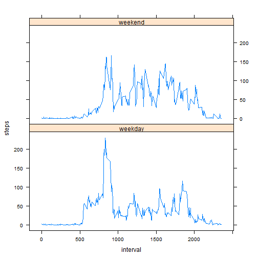

# Reproducible Research: Peer Assessment 1


## Loading and preprocessing the data

Storing data in df data frame. Also transform the date field to `Date` format and print a sample of values to understand the data.


```r
df <- read.csv("./activity.csv")
df$date <- as.Date(activity$date)
```

```
## Error: object 'activity' not found
```

```r
df1 <- df[which(df$steps != "NA"), ]
head(df1)
```

```
##     steps       date interval
## 289     0 2012-10-02        0
## 290     0 2012-10-02        5
## 291     0 2012-10-02       10
## 292     0 2012-10-02       15
## 293     0 2012-10-02       20
## 294     0 2012-10-02       25
```

```r
summary(df1)
```

```
##      steps               date          interval   
##  Min.   :  0.0   2012-10-02:  288   Min.   :   0  
##  1st Qu.:  0.0   2012-10-03:  288   1st Qu.: 589  
##  Median :  0.0   2012-10-04:  288   Median :1178  
##  Mean   : 37.4   2012-10-05:  288   Mean   :1178  
##  3rd Qu.: 12.0   2012-10-06:  288   3rd Qu.:1766  
##  Max.   :806.0   2012-10-07:  288   Max.   :2355  
##                  (Other)   :13536
```

## What is mean total number of steps taken per day?

```r
library(plyr)
total_per_day <- ddply(df1, .(date), summarise, steps=sum(steps))
hist(total_per_day$steps, main="Number of Steps", 
     xlab="Total number of steps taken each day", col="green")
```

 

```r
# mean and median for the total number of steps taken per day
mean(total_per_day$steps)
```

```
## [1] 10766
```

```r
median(total_per_day$steps)
```

```
## [1] 10765
```

## What is the average daily activity pattern?

```r
average_daily_interval <- ddply(df1, .(interval), summarise, steps=mean(steps))
plot(average_daily_interval$interval, average_daily_interval$steps, type="l", 
     col="blue",
     xlab="5-minute interval", 
     ylab="Average number of steps taken",
     main="Average daily activity pattern")
```

 

```r
# Which 5-minute interval, on average across all the days in the dataset, contains the maximum number of steps?
average_daily_interval[average_daily_interval$steps==max(average_daily_interval$steps),]
```

```
##     interval steps
## 104      835 206.2
```

```r
colnames(average_daily_interval)[2] <- "intervalAvg"
```

## Imputing missing values

```r
#calculating total number of missing values in the dataset
sum(is.na(df$steps))
```

```
## [1] 2304
```

```r
#filling in all of the missing values in the dataset
filling <- arrange(join(df, average_daily_interval), interval)
```

```
## Joining by: interval
```

```r
filling$steps[is.na(filling$steps)] <- filling$intervalAvg[is.na(filling$steps)]

# Histogram
total_per_day1 <- ddply(filling, .(date), summarise, steps=sum(steps))
hist(total_per_day1$steps, main="Number of Steps", 
     xlab="Total number of steps taken each day", col="red",)
```

 

```r
# mean and median total number of steps taken per day
mean(total_per_day1$steps)
```

```
## [1] 10766
```

```r
median(total_per_day1$steps)
```

```
## [1] 10766
```

```r
totalSteps1 <- sum(df1$steps)
totalSteps2 <- sum(filling$steps)
difference <- totalSteps2 - totalSteps1 []
```
So here we see that the mean values didn't change but the histogram and median did.

## Are there differences in activity patterns between weekdays and weekends?

```r
library(lattice)
weekdays <- weekdays(as.Date(filling$date))
weekdaysData <- transform(filling, day=weekdays)
weekdaysData$wk <- ifelse(weekdaysData$day %in% c("Saturday", "Sunday"),"weekend", "weekday")
average_by_interval_wk <- ddply(weekdaysData, .(interval, wk), summarise, steps=mean(steps))

xyplot(steps ~ interval | wk, data = average_by_interval_wk, layout = c(1, 2), type="l")
```

 
